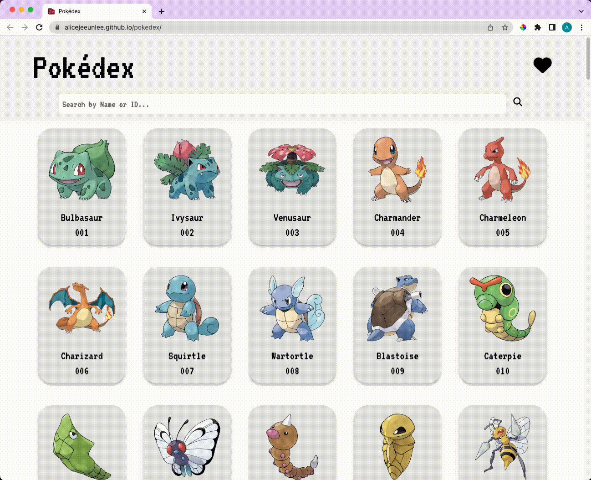
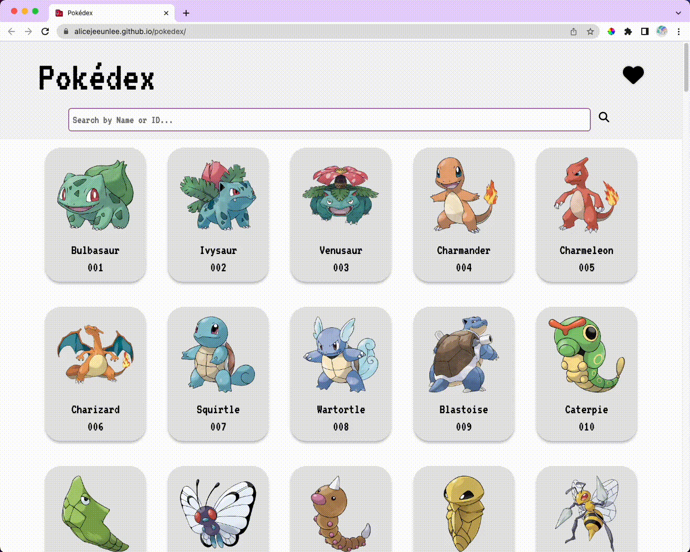

# pokédex

A dynamic HTML, CSS, and JavaScript web application for Pokémon fans featuring Generation 1 (the OG) Pokémon.

### 💡 Why I Built This

This solo project was built with HTML, CSS, and vanilla JavaScript to get a good foundation on DOM manipulation, AJAX, working with data from an API, and JSON to store and retrieve data from previous sessions.

Having grown up playing the games and watching the series, I wanted to take a stab at recreating the Pokédex for Generation 1 (the best) Pokémon while adding a little bit of *spice*~.

### 🔗 Live Demo

Try the application live at https://alicejeeunlee.github.io/pokedex/

## 💻 Technologies Used

* Javascript (ES5)
* HTML5
* CSS3
* [PokéAPI](https://pokeapi.co/docs/v2)

## 🔍 Preview




## 📝 Features

* User can view entries of all Pokémon
* User can view details of each Pokémon
* User can search for a specific Pokémon
* User can add favorite Pokémon
* User can remove Pokémon from favorite list

## 🔭 Stretch Features

* User can filter Pokémon by type
* User can play 'Who's That Pokémon' game

## 👩🏻‍💻 Development
### ⚡️ Getting Started

1. Clone the respository.

```
git clone https://github.com/alicejeeunlee/pokedex.git
```

2. Start the project. Once started, view the application by opening http://localhost:5500 in your browser.
